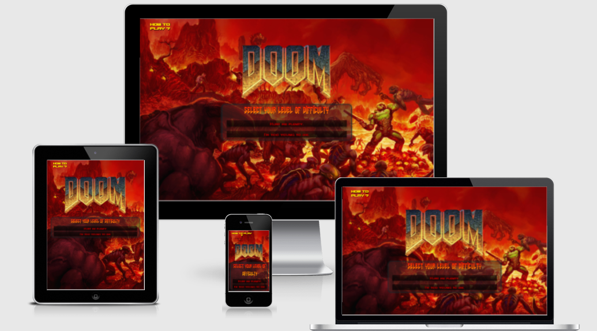
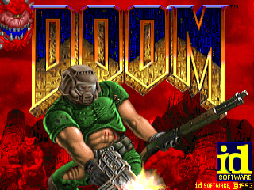

# **Doom**



## **Goal for this project** 

Have you been craving a way to test your knowledge on the legendary original first person shooter game??
Well, here is the answer to your prayers.
This game will test how well you know the Doom game series.


## **UX**

### **Site Objectives**

* A website that functions as a trivia quiz
* The site will be responsive and accessible and responsive
* Elements will be visually appealing and eye-catching
* The site should handle user input and generate appropriate responses and feedback for the user
* The site will provide the user with multiple choices for each question
* The users answers will be checked against correct answers to determine the score
* The score will be kept as the user advances in the quiz
* The final outcome of the quiz will be returned to the user at the end
* The site should generate questions appropriate to the difficulty selected by the user

### **User Stories**

* As a user, I want to know how to use the game
* As a user, I want to start a game easily
* As a user, I want the site to be accessible
* As a user, I want the Doom theme to be evident and to reminisce over the classic game
* As a user, I want to receive feedback on whether I got the question right or wrong
* As a user, I want to know what my score is at any time
* As a user, I want to know how well I did on completion of the game
* As a user, I want to be able to turn site sounds and music on or off
* As a user, I want to be able to select the level of difficulty of the game
* As a user, I want to receive questions at the level of difficulty I selected


### **Design Choices**

#### **Fonts** 

* To stick to the Doom theme I opted to use the Amazdoom font by Amazingmax fonts and Space Marine by Pixel Kitchen which I downloaded from [fontspace](https://www.fontspace.com/category/doom).
* I used the @fontface rule and used a [W3 Schools](https://www.w3schools.com/css/css3_fonts.asp) lesson to guide me.
* For the gradient effect I used code from [CSS Gradient](https://cssgradient.io/blog/css-gradient-text/)
* For the backup fonts I used [Google Fonts](https://fonts.google.com/)

#### **Icons**

For the favicon I used [Favicon Generator](https://favicon.io/favicon-converter/) to create a favicon from one of the doom guy face images and,
I used [Font Awesome](https://fontawesome.com/v5.15/icons/volume-mute?style=solid) for the toggle mute button 

#### **Colors**

To stick with the color theme of the original game's title page I went with reds and yellows that we mainly see on the title image. 
I had to be cautious to ensure that the bright coloured text wouldn't get lost in the bright background image so I used a dark background with opacity for the game area and other features so the background image was still the main feature.

Here's an image of the title screen I took inspiration from:



#### **Structure**

I structured my site to have one section where different elements would appear and disappear as they were needed.
I ensured that the open menu, game area and any updates/announcements were centered on the site using display - flex so the user could easily play without scrolling or changing pages. For elements that needed to stack on smaller screens I utilised display - grid.

## **Wireframes**

I used Balsamic to create the wireframes for this site. First I started witha basic wireframe for the mobile and scaled up to the desktop. This site will only consist of one page and I've decided to aim for a more minimilistic design so as not to complicate the game. The game will be easier to play with this design as users will have the game right in front of them immediately.

### [Desktop Wireframe](wireframes/desktop.png)

### [Tablet Wireframe](wireframes/tablet.png)

### [Mobile Wireframe](wireframes/mobile.png)


## **Features**
 
### **Existing Features**

* The main feature of the site is the backgrough image which was taken from the [Doom 2016 main image](https://cdn.vox-cdn.com/thumbor/NVxK5PkR95tMXoOZRqKwSwMq_XA=/1400x788/filters:format(jpeg)/cdn.vox-cdn.com/uploads/chorus_asset/file/19197653/doom_2016_key_art.jpeg) which I found on google image search.
* I also took the [Doom title image](https://e7.pngegg.com/pngimages/460/506/png-clipart-doom-doom.png) from a google image search result as it already had a transparent background and saved me having to change it with GIMP editor.
* Open menu to select difficulty level of the questions
* How to play modal that explains the game rules
* Game area that displays questions, answer buttons for multiple choice, lives left display, current streak display.
* Score updates that inform the user if they answered correctly and how many lives/correct answers they are on
* A character face image that changes with respect to how many lives the player has left
* Final outcome display messages that inform the player the outcome of the game
* A modal that displays game rules and how to play for players that are unsure of what to do
* Game music that is themed around the 1993 Doom game which can be toggled on and off with a mute button

### **Ideas for more Features**

* Add functionality to be able to start another game after finishing a game
* Incorporate a quit game function so users can exit the game back to the menu at any time
* Add more animations to the doom guy face such as a hurt face when you get a question wrong or an evil face when you get one right
* Add more difficulty levels and questions
* Add more music and sounds to correspond with outcomes of questions and game results

## **Technologies used**
 
### **Languages**

* [HTML](https://en.wikipedia.org/wiki/HTML)
* [CSS](https://en.wikipedia.org/wiki/Cascading_Style_Sheets)
* [JavaScript](https://en.wikipedia.org/wiki/JavaScript)

### **Libraries and Frameworks**

* [Font Awesome](https://fontawesome.com/)
* [jQuery](https://jquery.com/)
* [Bootstrap](https://getbootstrap.com/)
* [Google Fonts](https://fonts.google.com/)

### **Tools**

* [Git](https://git-scm.com/)
* [GitPod](https://www.gitpod.io/)
* [Balsamic](https://balsamiq.com/wireframes/)
* [W3C HTML Validation Service](https://validator.w3.org/)
* [W3C CSS Validation Service](https://jigsaw.w3.org/css-validator/)
* [JSHint](https://jshint.com/)
* [Favicon Generator]((https://favicon.io/favicon-converter/))


## **Testing**

#### As a user, I want to know how to use the game
* **Goals**    
When a user needs info on how to play the game, there should be a feature to give this info.
* **Method**   
I added an extra button to the body 'How to Play?' that opens a modal with the game rules and info on how to play. 
The modal is bullet pointed and clearly outlines the rules of the game and how to play the game.
The modal can then be closed when the user has read the rules by clicking the x or outside the modal
* **Test**    
I have tested the modal on various browers and devices and it functions perfectly. 
* **Results**    
The modal functions as expected and aids users to understand how the game works  
     PASS

#### As a user, I want the site to be accessible and responsive
* **Goals**    
The app should work on all user devices and browsers and be easily accessible to users with visual impairements
* **Method**   
I employed various methods with css and bootstrap to ensure responsiveness. With elements like the answer buttons, I used grid so they would stack on smaller screens and with the game area and bigger elements I used Flex to position them centrally. I used bright text colours to contrast against the dark background of the game area and added shadow to make the text really stand out. I provided alt text and descriptions for non-text content.
* **Test**  
I tested the site on various different screens to ensure responsiveness.  
I tested the accessibility on [Google Lighthouse](https://developers.google.com/web/tools/lighthouse) 
I got my mother and father to test the game on different screen sizes to get feedback on whether they had difficulty reading the text or playing the game as they both have poor sight.
* **Results** 
The app performed well on all screen sizes and was responsive and easy to use.   
The accessibility outcome was very good on [Google Lighthouse Results](https://googlechrome.github.io/lighthouse/viewer/?gist=1e2892915ee1d8250dfed59e8a378415).
Both my mother and father had no issues using the app on any device and they would usually struggle with text on mobile screens  
     PASS

#### As a user, I want the Doom theme to be evident and to reminisce over the classic game
* **Goals**    
The minute a user opens this quiz they should have no doubt about the theme of this quiz. It should be blatantly obvious to anyone who has had any exposure to the game series that this app is themed around the Doom games.
* **Method**   
I incorporated The title image from the game and a huge background image with many of the demons and the main character from the game in hell, where the game is based.
I also used text that can be seen in the game and used a color scheme resembling the games color scheme.
The Doom Theme music is a feature that I found very effective at reminding me of the original game, as music is always associated with bringing people back to a point in time.
* **Test**    
I tested the app with a few friends of mine that would have grown up at the same time and played the game when they were younger.
* **Results**   
The friends that I tested the game on all knew right away what the theme was and where the inspiration came from. They actually mentioned the faces of the character were the feature that was their fondest emeories of the game  
     PASS

#### As a user, I want to receive feedback on whether I got the question right or wrong
* **Goals**    
When correct answer is selected, there should be a message letting the player know that they've answered correctly 
Likewise when the wrong answer is selected, there should be a message informing the player they chose wrongly
* **Method** 
I added a function called checkAnswer to check the answer and displays the appropriate message in a div that temporarily slidesDown into the game area. I ensured to add enough time between the transitions so that the player could read the message.
* **Test**    
I tested the check answer functionality across various devices and browers to make sure it works as planned. 
* **Results**   
The functionality is working as expected and is displaying the correct message at the right time  
     PASS

#### As a user, I want to know what my score is at any time
* **Goals**    
I planned to display just the face of the character as a reference for how well you were doing in the game but decided to be more explicit and included the number of lives and current streak of correct answers on a hud beside the characters face.
* **Method**   
I added a score div to display the information and the characters face. I added variables in the javascript to set the lives, streak and question index so these variables could be displayed on the score div.
They would be incremented/decreased depending on the correct/incorrect answers.
When game is starting, lives are set to 3 and streak to 0. The streak increases if the user answers correctly and returns to zero if the user answers incorrectly. They will also gain a life every time they answer 3 correct in a row. When they answer a question wrong they will lose a life. Question index increases as the game progresses and different questions appear each time.
* **Test**    
I have tested this feature with both difficulty levels and across various browers and devices. 
* **Results**    
Streak is incremented correctly on a correct answer and goes to 0 when the answer was wrong. The player gains a life every time they answer 3 questions correct and lose a life every time they answer a question wrongly. 
Correct lives and streak being displayed on the screen at all times.  
     PASS

#### As a user, I want to know how well I did on completion of the game**    
* **Goals** 
After completing the game, There should be a message displaying the outcome of the game so the user knows how they did. 
* **Method**   
I created two separate divs to display the two outcomes of you died or you survived. I triggered the you die div to display only after the player had no lives left and the you survived div to display after the player had got all the way through the quiz with lives remaining.
The two messages clearly stated the outcome of the game and included an image of the character either dead or smiling depending on the outcome.
* **Test**    
I tested all the possible outcomes that to make sure the correct message was being displayed at the end of the game.
* **Results**  
The correct message was displayed and corresponded with the outcome of the game every time  
     PASS

#### As a user, I want to be able to turn site sounds and music on or off
* **Goals**    
The music functionality is great but if soomebody didn't want to listen to it or needed silence they should have an option to mute the music
* **Method**   
I implemented a mute button on the top right corner of the game area so that the user could toggle music on/off
* **Test**    
I tested the feature on various browsers and devices to ensure the toggle mute button did as expected.
* **Results**  
The button functioned correctly and allowed the user to mute the music and play it again at will  
     PASS

#### As a user, I want to be able to select the level of difficulty of the questions
* **Goals**    
Before beginning the game the user should have the option to choose the difficulty level of the game. 
The user shouldn't be able to proceed when no difficulty is chosen.
* **Method**   
I added two buttons corresponding to easy and hard difficulty, when clicked would set the difficulty level of the questions and start the game. These buttons are the only way to begin the game. The correct question set should be returned for the game.
* **Test**    
I have tested all selecting both difficu;ty levels to make sure the correct questions are being displayed. 
* **Results**    
Difficulty level selection works as planned and returns correct questions on the various browsers and devices.  
     PASS

### **Bugs**

* **Bug** 

The images in the buttons wouldn't fit correctly

* **Fix**  

I found an article on [GeeksforGeeks](https://www.geeksforgeeks.org/how-to-auto-resize-an-image-to-fit-a-div-container-using-css/) that explained the exact issue and how to fix it. It was as simple as changing one line of CSS targeting the button and setting the object fit to cover.

* **Bug** 

I couldn't get any jQuery to work on my page even after including the script in the head

* **Fix**  

I found an way of testing if jQuery loaded on [stackoverflow](https://stackoverflow.com/questions/7341865/checking-if-jquery-is-loaded-using-javascript) and used the test function provided to see if I had loaded jQuery correctly.

```window.onload = function() {
    if (window.jQuery) {  
        // jQuery is loaded  
        alert("Yeah!");
    } else {
        // jQuery is not loaded
        alert("Doesn't Work");
    }
}
```
This test showed that I hadn't correctly installed jQuery so I went to [w3schools](https://www.w3schools.com/jquery/jquery_get_started.asp) and used the correct script for my header and this got me going with jQuery.

* **Bug**  

The game kept displaying the same question until I got it right

* **Fix** 

I added some console logs into my checkAnswer, correctAnswer and wrongAnswer functions which revealed that I was stuck in the same loop because I only increased the question index in the correctAnswer function.
I then changed where the question index was increased to the getNextQuestion function so it would change the index each time a new question was needed.

* **Bug**    

The scoreupdate section shadowing was displaying at the start of the game before it had been revealed.
This was a s a result of the display:inline-block css attribute overwriting the display hidden attribute.

* **Fix**    

I removed the display:inline-block from the css. This ensured that the display attribute would only be overwritten when the score update would be displayed

* **Bug**

The final two questions are the same every time.

* **Fix**  

After debugging in the browser by console logging the question index and length of the questions list it became clear that I had miscalculated when to end the game if a player had survived.
Instead of ending the game if the question index was equal to the length of the questions list which is 10, I set it to the length of the question list minus one. This is to take into account that indexing starts at 0 not 1.

* **Bug** 

The bullet points of the game instructions were black and couldn't be seen with the dark background

* **Fix** 

I found a fix on [w3schools](https://www.w3schools.com/howto/howto_css_bullet_color.asp) that did exactly what I needed.

* **Bug**   

The answer, mute and how to buttons weren't displaying on mobile

* **Fix**

Initially I suspected the fonts weren't loading and I had realised that I didn't add secondary fonts in case they didn't load.         
I found a font on [Google Fonts](https://fonts.google.com/specimen/Trade+Winds?query=trade) that replaces amazdoomleft quite well and I also found a similar one called orbitron which matches the space marine font very well.
Upon loading these new fonts into the site it still didn't display the text in the buttons or in the game instructions.
I found an article on [Stack Overflow](https://stackoverflow.com/questions/31289537/webkit-text-fill-color-transparent-not-working-in-safari-7-1-7) which explained exactly the issue I was up against and realised that the webkit fill color was causing the issue. After attempting numerous solutions on the page to try and implement the webkit fill color feature I eventually decided it wasn't worth losing functionality for a gradient on some text so I ommited the feature and stuck with a basic text shadow instead to highlight the text.

## **Deployment**

I deployed this site using github pages. My mentor instructed me through the process.
The steps involved included:

1. Go to settings in the github repository and navigate to the pages section
1. Select branch master and save
1. The site is now live on **https://hjtb.github.io/Doom-Quiz/**
1. Commits and pushes are received by github and the page updates soon after

### **Running Locally**

Running the project locally can be done in a few short steps.

1. In the repo, click the clone or download button
1. Copy the link using the clone with https option
1. Open your development environment with the git terminal open and change working directry to the new repo location
1. Using the git clone command paste the URL you copied from earlier
 
## **Credits**

* The function named shuffle was taken from [javascript.info](https://javascript.info/task/shuffle)
* I got my questions from [THE QUIZ](https://www.thequiz.com/how-well-do-you-know-doom/)
* The video from [Web Dev Simplified](https://www.youtube.com/watch?v=riDzcEQbX6k) really helped me work through the logic of making this app
* I took a lot of the images and the music theme from [yvesgurcan Github project](https://github.com/yvesgurcan/jsdoom)
* Finally I'd like to thank my family and friends for testing the app and special thanks goes out to the two lads, [Adam](https://github.com/klexas) and [Alex](https://github.com/apssouza22), of Creative Underground, and [Peter](https://github.com/pbs-websuntangled) of [Dt-squad](https://www.dt-squad.com/) for helping me with a few of the tricky elements that I needed guidance on.

### **Inspiration**
It's pretty obvious where my inspiration for the app came from. I was one of those young lads sneaking into my uncles room to turn on his PC to play Doom and running out after 15 minutes because I was terrified.
If you've a few hours to spare and want to reminisce on your childhood and your first experience of a first person shooter, then check out the [online version](https://playclassic.games/games/first-person-shooter-dos-games-online/play-doom-online/play/) of this classic game. I wasted more hours playing the game and procrastinating than I'd like to count. Enjoy.
